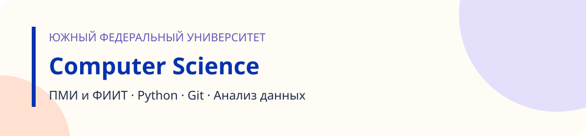

  

<h1 align="center">Практикум по Computer Science</h1>

  Южный федеральный университет · направления ПМИ и ФИИТ 
  условия лабораторных · теория · шпаргалки · презентации лекций

---

## 🧭 Выберите своё направление

<table>
<tr>
<td width="50%" valign="top">

### [ПМИ →](pmi/README.md)
Прикладная математика и информатика

- [Лабораторная 01 · Первые программы на Python](pmi/lab01/README.md)
- [Лабораторная 02 · Git и GitHub](pmi/lab02/README.md)
- [Как начать и как сдавать](pmi/docs/STUDENT.md)

</td>
<td width="50%" valign="top">

### [ФИИТ →](fiit/README.md)
Фундаментальная информатика и информационные технологии

- [Лабораторная 01 · Первые программы на Python](fiit/lab01/README.md)
- [Лабораторная 02 · Git и GitHub](fiit/lab02/README.md)
- [Как начать и как сдавать](fiit/docs/STUDENT.md)

</td>
</tr>
</table>

## 📚 Что есть в каждой лабораторной

| Файл | Что внутри |
|---|---|
| `README.md` | условие, порядок выполнения, как сдать и как оценивается |
| `THEORY.md` | теория по теме — учебник к лекции |
| `CHEATSHEET.md` | шпаргалка: команды, форматы, частые ошибки |

Презентации лекций и практикумы в формате Word — в [материалах](materials/README.md).

## 🚀 Как сдавать

Работы проверяет сервис: вы отправляете решение, он запускает проверки и показывает подробный разбор —
что ожидалось, что получилось и что исправить. Адрес сервиса сообщит преподаватель.

| Лабораторная | Как сдать в сервисе | И ещё |
|---|---|---|
| **01** · Первые программы на Python | файлами или ZIP-архивом — **Git не нужен** | [копия в Moodle](#moodle) |
| **02** · Git и GitHub | ссылкой на свой репозиторий `cs-practice` | [копия в Moodle](#moodle) |

Подробно — в инструкции своего направления: [ПМИ](pmi/docs/SUBMISSION.md) · [ФИИТ](fiit/docs/SUBMISSION.md).

## 🎓 Дублирование в Moodle

Каждое решение нужно **продублировать в Moodle** — после отправки в сервис загрузите ту же работу в курс.

<!-- ССЫЛКА НА КУРС В MOODLE: замените «ссылка появится здесь» на ссылку -->
**Курс в Moodle:** ссылка появится здесь

| Лабораторная | Что загрузить в Moodle |
|---|---|
| **01** · Первые программы на Python | те же файлы `task01.py` … `task07.py` или ZIP-архив |
| **02** · Git и GitHub | ссылку на свой репозиторий и полный SHA сдаваемого коммита из `git rev-parse HEAD` |

## 🔄 Новые задания

Лабораторные публикуются по мере курса — условия читайте здесь. Решения вы ведёте в собственном
репозитории `cs-practice`, который создаёте во второй лабораторной; синхронизировать его с этим не нужно.

## 🔒 Правила

- Ваш публичный репозиторий виден всем. **Не добавляйте** пароли, токены и сведения об одногруппниках.
- Работа индивидуальная. Сервис сравнивает решения между собой по структуре кода — переименование
  переменных совпадение не скрывает.
- Нашли ошибку в условии — напишите преподавателю номер лабораторной и короткий пример.

---

Репозиторий курса: https://github.com/Ekaterina0801/CS-AI-MMCS
