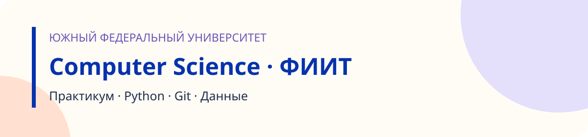

<p align="center">
  
</p>

# Практикум по Computer Science · ФИИТ

<p>


</p>

**[С чего начать](docs/STUDENT.md)** · **[Как сдавать](docs/SUBMISSION.md)** · [Moodle](../README.md#moodle) · [Материалы лекций](../materials/README.md) ·
[Другое направление: ПМИ](../pmi/README.md)

## Лабораторные

| № | Тема | Как сдать | Статус |
|:---:|---|---|---|
| 01 | [Первые программы на Python](lab01/README.md) | файлами или ZIP | ✅ выдана |
| 02 | [Git и GitHub](lab02/README.md) | ссылкой на fork | ✅ выдана |
| 03 | [Алгоритмическое мышление и основы Python](lab03/README.md) | — | 🛠 готовится |
| 04 | [Функции и списки](lab04/README.md) | — | 🛠 готовится |
| 05 | [Работа с файлами и табличными записями](lab05/README.md) | — | 🛠 готовится |
| 06 | [Словари и множества](lab06/README.md) | — | 🛠 готовится |
| 07 | [NumPy I](lab07/README.md) | — | 🛠 готовится |
| 08 | [NumPy II](lab08/README.md) | — | 🛠 готовится |
| 09 | [pandas I](lab09/README.md) | — | 🛠 готовится |
| 10 | [pandas II](lab10/README.md) | — | 🛠 готовится |
| 11 | [pandas III](lab11/README.md) | — | 🛠 готовится |
| 12 | [pandas IV](lab12/README.md) | — | 🛠 готовится |
| 13 | [Визуализация данных в Matplotlib](lab13/README.md) | — | 🛠 готовится |
| 14 | [Простой анализ данных](lab14/README.md) | — | 🛠 готовится |

Лабораторные с пометкой «готовится» ещё не выданы: сдавать их не нужно, условие появится перед занятием.

Каждое решение, отправленное в сервис, **продублируйте в Moodle** — [ссылка на курс](../README.md#moodle).

## Лекции

| № | Тема | Презентация |
|:---:|---|---|
| 01 | Вычислительные системы и программная среда | [скачать](../materials/lectures/lecture-01-fiit-computing-systems.pptx) |
| 01 | Введение в Computer Science — общая лекция ПМИ и ФИИТ | [скачать](../materials/lectures/lecture-01-cs-intro.pptx) |
| 02 | Git и GitHub | [скачать](../materials/lectures/lecture-02-fiit-git-github.pptx) |

## Как устроена папка

```
fiit/
├── lab01/           ← условие, теория, шпаргалка, шаблон отчёта и заготовки задач
├── lab02/           ← условие, теория и шпаргалка по Git
├── lab03 … lab14/   ← появятся по мере курса
└── docs/            ← как начать и как сдавать
```

Во второй лабораторной работу ведут в папке `lab02` **в корне** вашего fork — так написано в условии.

---

<sub>[← Главная страница курса](../README.md)</sub>
