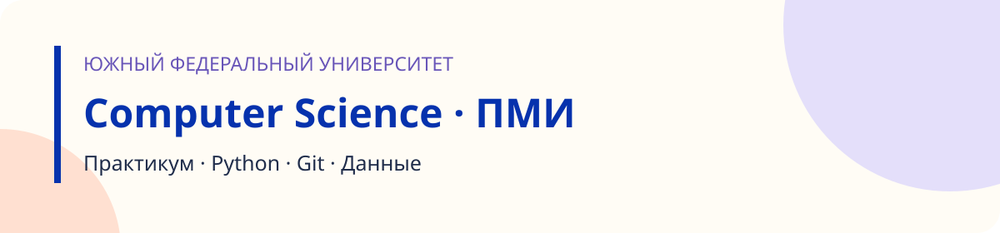

# Практикум по Computer Science · ПМИ

Преподавательский раздел заданий. **14 практик · один общий fork на студента · решения в папках lab01–lab14.**

[Начать работу](docs/STUDENT.md) · [Правила сдачи](docs/SUBMISSION.md) · [Преподавателю](docs/TEACHER.md) · [Интерфейс автопроверки](docs/GRADING-CONTRACT.md)

## С чего начать

1. Нажмите **Fork** на странице репозитория преподавателя и создайте свою копию.
2. Скачайте свой fork через **Code → HTTPS**, затем `git clone`. Перейдите в папку pmi перед выполнением команд.
3. Откройте [практику 01](lab01/README.md). Решения добавляйте в свою копию.
4. Проверьте работу локально и отправьте изменения в свой fork.

```bash
python tools/check.py lab01
```

Команда выполняется из папки направления и печатает количество пройденных открытых тестов. Заготовка первой практики намеренно содержит незавершённое решение.

## Практики

| № | Тема | Статус |
|---|---|---|
| 01 | [Введение в Computer Science и вычисления](lab01/README.md) | Опубликована |
| 02 | [Git и GitHub как система контроля версий](lab02/README.md) | Опубликована |
| 03 | [Воркшоп по Git](lab03/README.md) | Готовится |
| 04 | [Повторение Python для обработки данных](lab04/README.md) | Готовится |
| 05 | [Текстовые файлы](lab05/README.md) | Готовится |
| 06 | [Файловая система в Python](lab06/README.md) | Готовится |
| 07 | [Форматы хранения данных](lab07/README.md) | Готовится |
| 08 | [Минимально необходимый NumPy](lab08/README.md) | Готовится |
| 09 | [Введение в pandas](lab09/README.md) | Готовится |
| 10 | [Преобразование и очистка данных в pandas](lab10/README.md) | Готовится |
| 11 | [Агрегирование и объединение данных в pandas](lab11/README.md) | Готовится |
| 12 | [Matplotlib](lab12/README.md) | Готовится |
| 13 | [Seaborn и Plotly](lab13/README.md) | Готовится |
| 14 | [Воспроизводимый анализ данных](lab14/README.md) | Готовится |

## Как сдаём

Сейчас: ссылка на свой репозиторий, номер практики и SHA коммита. После подключения сервиса эти данные будут регистрироваться в кабинете. **Сервис пока не подключён, автоматической официальной оценки здесь нет.**

Открытые тесты помогают проверить себя. Итог включает проверку преподавателем и объяснение решения. Для практики 02 проверяется история Git; тесты Python не применяются.

## Устройство курса

- `labNN/README.md` — условие и критерии конкретной практики.
- `labNN/REPORT.md` — краткий отчёт студента.
- `lab01/tests/` — открытые тесты первой практики.
- `tools/check.py` — локальная самопроверка с итоговым счётчиком.
- `course.json` — каталог практик для будущего сервиса.
- `docs/` — инструкции студенту и преподавателю.

## Материалы

[Учебник по первой теме](lab01/docs/textbook.md) · [Разбор первой практики](lab01/docs/theory.md)

Темы взяты из предоставленного плана ПМИ. В плане 16 тем; этот репозиторий охватывает практики 01–14 по согласованному объёму. DataLens и итоговый проект (темы 15–16) не включены и не перенумерованы.

Публичный fork доступен другим пользователям. Не добавляйте пароли, токены или персональные сведения одногруппников. Для закрытых решений преподаватель выдаёт отдельный приватный репозиторий из шаблона.

[Общая главная страница](../README.md)
